 # Mini Projet Framework d'Injection des dépendances

Concevoir et créer un mini Framework d'injection des dépendances similaire à Spring IOC Le Framework doit permettre à un programmeur de faire l'injection des dépendances entre les différents composant de son application respectant les possibilités suivantes :

    1- A travers un fichier XML de configuration en utilisant Jax Binding (OXM : Mapping Objet XML)
    
    2- En utilisant les annotations
    
    3- Possibilité d'injection via :
            
        a- Le constructeur
        
        b- Le Setter
        
        c- Attribut (accès direct à l'attribut : Field)


### 1- XML: 
la forme de fichier XML : exemple (1 ==> : `tstXML.xml`,ou, 2 ==> : `tstXMLV2.xml`)
* main balise : inject 
* pour créer un objet, a utilisé la balise `crt_object`: on spécifie la Class et Ids(pour créer plusieurs objets de même class sans créer plusieurs balises):
  * 1==>
    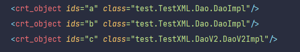
  * 2==>
    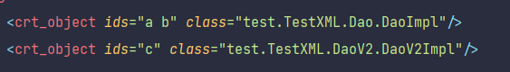

* injection par constructeur on utilise la balise  `by_constructor_arg`: on spécifie la Class et values (si on a plusieurs valeurs de même type on peut le regrouper dans même valeurs on les sépare par espace)
  * 1==>
    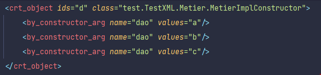
  * 2==>
    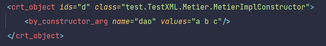

* injection par setter on utilise la balise  `by_setter`: on spécifie les noms des variables  et leur id Refs (on les sépare par espace)
    * 1==>
      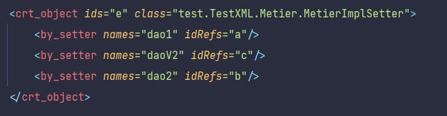
    * 2==>
      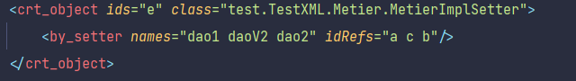

* de même pour l'injection par attribut :
    * 1==>
      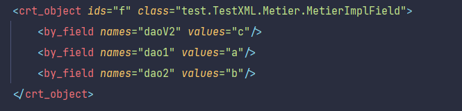
    * 2==>
      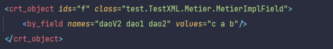


 pour lire le fichier XML , on utilise `JAXBContext` pour ça j'ai crée les classes (Inject,ByField,ByConstructorArg,BySetter,CrtObject)

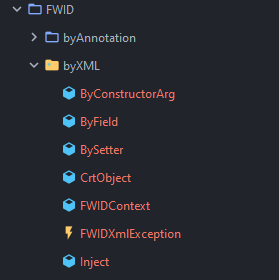

#####FWIDContext:
    source: `src/FWID/byXML/FWIDContext.java`
    c'est la class qui crèer les objects et les injecters
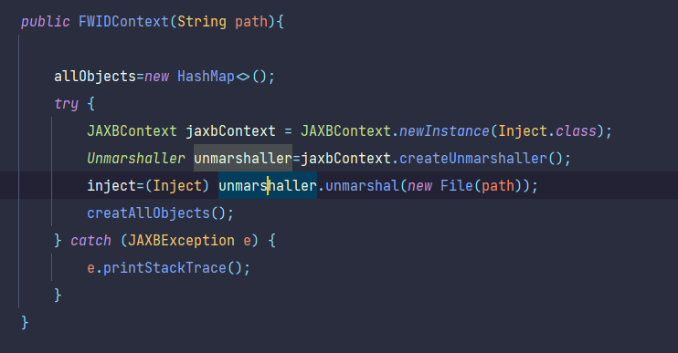
- Pour get un instance on utilise la fonction
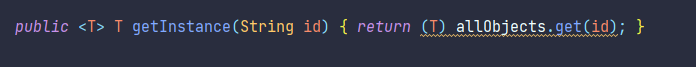
#####injection par constructeur:
- Obtenir tous les paramètres dans fichiers XML
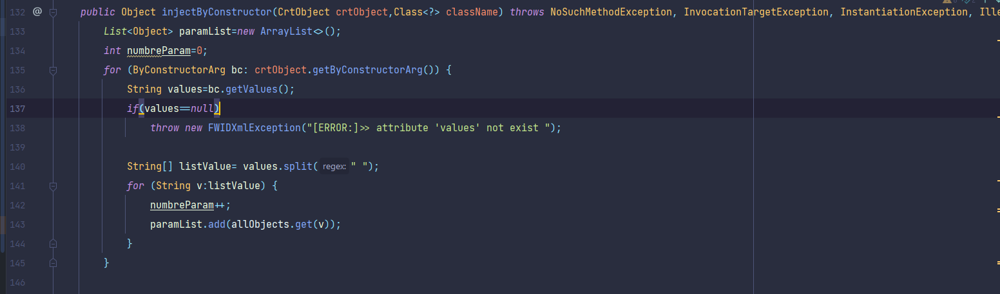
- Comparer les types des arguments des constructeurs  avec les types des objets passer
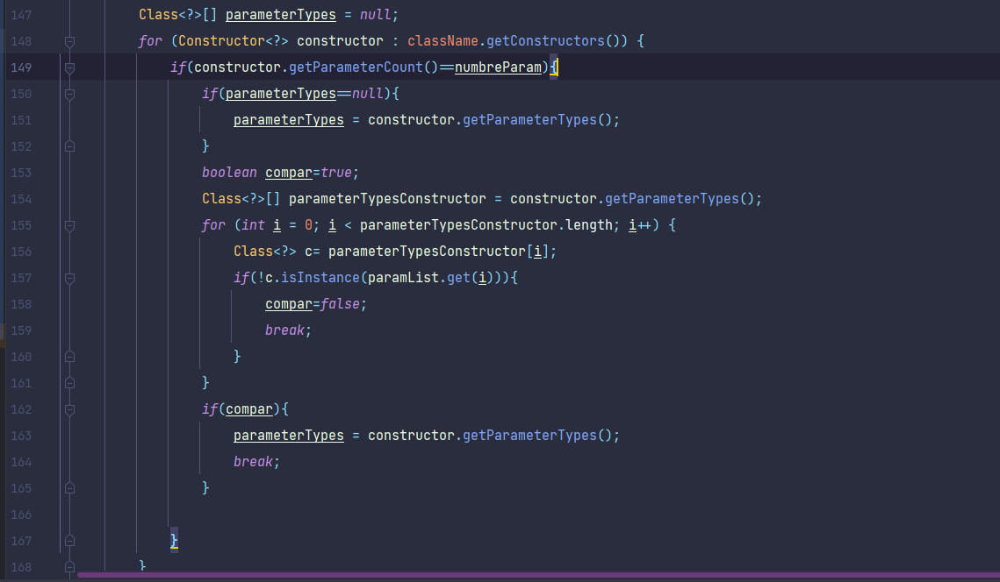
- Si les types des paramètres != null on crée une instance par constructeur et on passe les paramètres
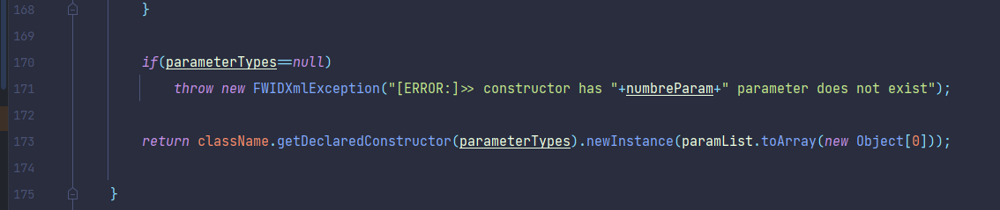

#####injection par setter:
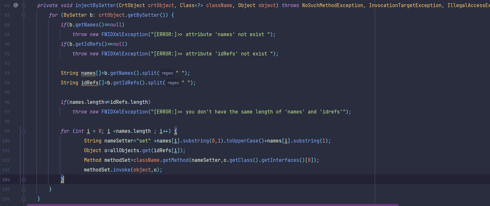

#####injection par attribut:
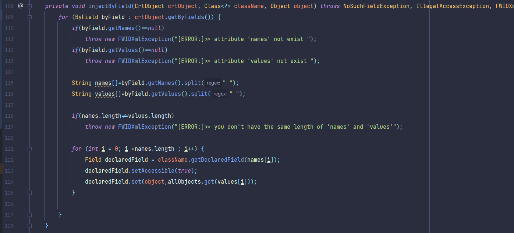


#### comment l'utiliser : (exemple test:`src/test/TestXML/mainTest.java`)

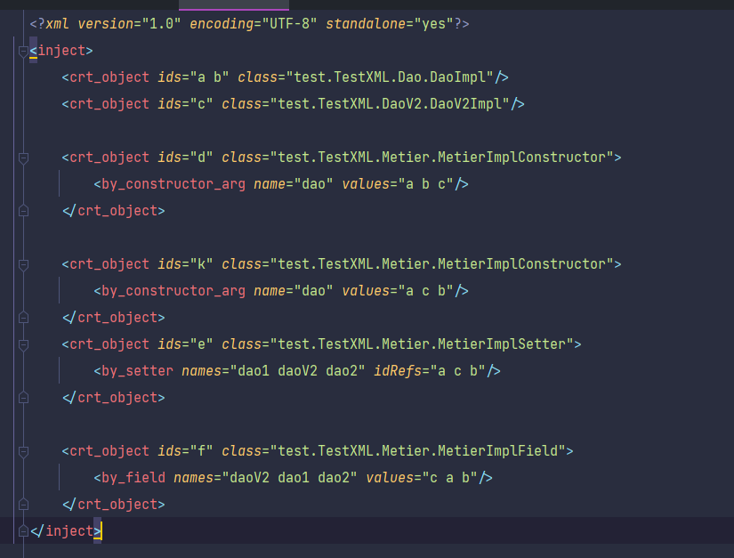

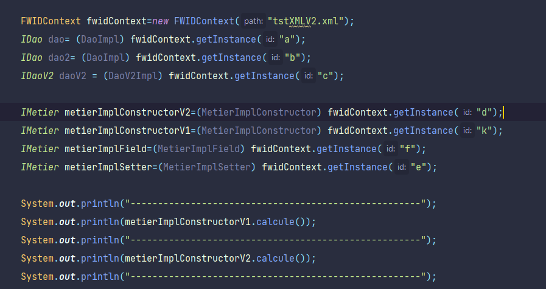


------------------------------------------------------------------------------
------------------------------------------------------------------------------

### 2- Annotation 
##### les annotations:
* NameInject
  * utiliser sur les classes pour les donner un nom
  
  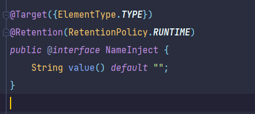
  
  * exemple:
  
  

* Inject:
  * value : si pour le type of injection 
    (NEW : pour chaque injection on cree un nouveau object,SINGLE_ONE : pour toutes les injections on utilise le même object )
  * id : on l'utilise dans le cas de valeur : SINGLE_ONE pour spécifier l'object
  * name : le nom qui vous le donne au class (par NameInject)
  
  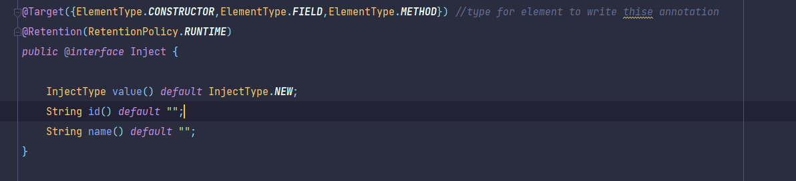

  * exemples:

  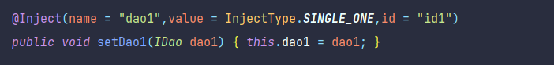

  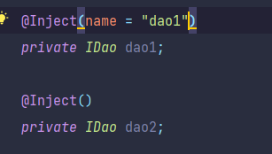

#### les classes utiliser :
* AnnotationContextImpl:
  * permet d'enregistrer tout les classes (methode `public void annotationConfigure(Class<?>... classTypes)` ou `public void annotationConfigure(String... packageNames)`) 
  * permet de trouver la classe pour l'injection (methode `public <T> Class<? extends T> getClassInject(Class<T> type,String name)`)
* Injector:
  * on le passe un object IAnnotationContext
  * permet de créer un instance de class (methode: ` public <T> T getBean(Class<T> cl)`)
  * pour ça on utilise les methodes suivant pour faire injection :
    * `private <T> T injectBySetter(Class<T> cl)`
    * `private <T> T injectByConstructor(Constructor<?> constructor, Class<T> cl)`
    * `private <T> T injectByField(Class<T> cl)`
  
#####injection par constructeur: (`src/FWID/byAnnotation/Injector.java`)
```ruby
  private <T> T injectByConstructor(Constructor<?> constructor, Class<T> cl) throws InvocationTargetException, NoSuchMethodException, InstantiationException, IllegalAccessException, FWIDAnnotationException {
         /*
            - get all parameters types of constructor
            - create list of objects for save objects
            - get bean for all parameters
         */
        Class<?>[] parameterTypes = constructor.getParameterTypes();
        Object[] depend=new Object[parameterTypes.length];

        for (int i1 = 0; i1 < parameterTypes.length; i1++) {
            if(constructor.getAnnotation(Inject.class).value()!=InjectType.SINGLE_ONE ||
                    !constructor.getAnnotation(Inject.class).name().equals("") ||
                    !constructor.getAnnotation(Inject.class).id().equals("")
            ){
                depend[i1]=getBean(annotationContext.getClassInject(parameterTypes[i1],""));
            }else
                System.out.println("[info]>>:annotation Inject for constructor '"+constructor.getName()+"' of class '"+cl.getName()+"' not need to add name or id or value ");

        }

        return cl.getConstructor(parameterTypes).newInstance(depend);
    }

```
#####injection par setter:(`src/FWID/byAnnotation/Injector.java`)
```ruby
 private <T> T injectBySetter(Class<T> cl) throws NoSuchMethodException, InvocationTargetException, InstantiationException, IllegalAccessException, FWIDAnnotationException {

        T t = cl.getConstructor().newInstance();

        // all methods of class cl
        for (Method method : cl.getMethods()) {

            // if method is a setter and has annotation Inject
            if (method.isAnnotationPresent(Inject.class) && method.getName().startsWith("set") && method.getParameterCount()==1) {
                String name=method.getAnnotation(Inject.class).name();

                // if name (in inject annotation) is "" we give name of method without 'set' and make the first letter lower case
                if(name.equals("")){
                     name=method.getName().replace("set","");
                    name=name.substring(0,1).toLowerCase(Locale.ROOT).concat(name.substring(1,name.length()));
                }

                Object o=null;
                // case InjectType is SINGLE_ONE
                if(method.getAnnotation(Inject.class).value()==InjectType.SINGLE_ONE)
                {
                    // if id exist
                    if(!method.getAnnotation(Inject.class).id().equals("")){
                        String id=method.getAnnotation(Inject.class).id();
                        if(saveObjects.containsKey(id)){
                            // get object from saveObjects
                            o=saveObjects.get(id);
                        }
                        else {
                            // get bean  and put it in saveObjects
                            o=getBean(annotationContext.getClassInject(method.getParameterTypes()[0],name));
                            saveObjects.put(id,o);
                        }
                    }else {
                        throw new FWIDAnnotationException("method '"+method.getName()+"' of class '"+cl.getName()+"' has InjectType equal to SINGLE_ONE but he dont have id");
                    }
                }

                if (o==null)
                    o=getBean(annotationContext.getClassInject(method.getParameterTypes()[0],name));

                method.invoke(t, o);
            }
        }
        return t;
    }
```
#####injection par attribut:(`src/FWID/byAnnotation/Injector.java`)
```ruby
  private <T> T injectByField(Class<T> cl) throws NoSuchMethodException, InvocationTargetException, InstantiationException, IllegalAccessException, FWIDAnnotationException {
        T instance = cl.getConstructor().newInstance();

        // for all field declaration of class cl
        for (Field declaredField : cl.getDeclaredFields()) {

            // if he has annotation Inject
            if(declaredField.isAnnotationPresent(Inject.class)){
                declaredField.setAccessible(true);
                String name=declaredField.getAnnotation(Inject.class).name();

                //if name equal to "" we give name of the field
                if(name.equals(""))
                    name=declaredField.getName();

                Object o=null;

                // case InjectType is SINGLE_ONE
                if(declaredField.getAnnotation(Inject.class).value()==InjectType.SINGLE_ONE)
                {
                    // if id exist
                    if(!declaredField.getAnnotation(Inject.class).id().equals("")){
                        String id=declaredField.getAnnotation(Inject.class).id();
                        if(saveObjects.containsKey(id)){
                            // get object from saveObjects
                            o=saveObjects.get(id);
                        }
                        else {
                            // get bean and put it in saveObjects
                            o=getBean(annotationContext.getClassInject(declaredField.getType(),name));
                            saveObjects.put(id,o);
                        }
                    }else {
                        throw new FWIDAnnotationException("method '"+declaredField.getName()+"' of class '"+cl.getName()+"' has InjectType equal to SINGLE_ONE but he dont have id");
                    }
                }
                if (o==null)
                    o=getBean(annotationContext.getClassInject(declaredField.getType(),name));
                declaredField.set(instance,o);
            }
        }
        return instance;
    }
```

#### explication de test : (`src/test/TestAnnotation`)
1. les classes : 
   1. package Dao (`src/test/TestAnnotation/Dao`): contient l'interface IDao et deux implimentations
       - DaoImpl: (pour tester le cas d'utilisation de l'annotation NameInject et pour test c'est on crèe un nouveau object ou non)

         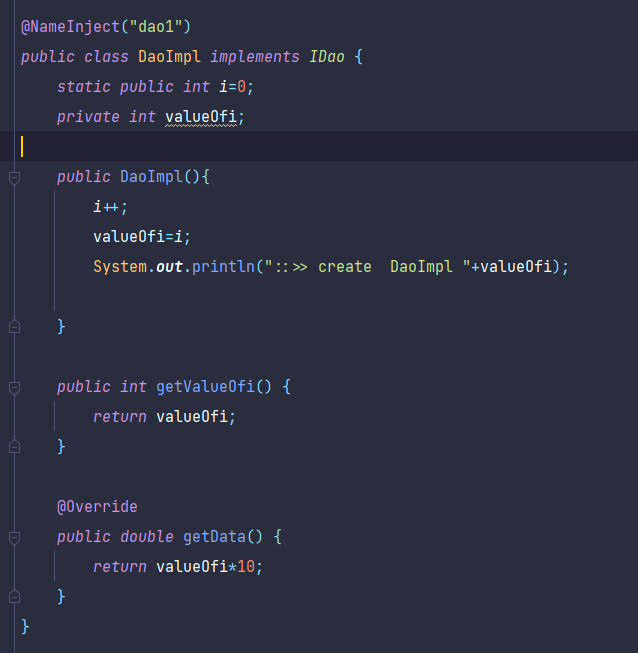
      
       - DaoImpl2: (pour tester le cas sans utiliser l'annotation NameInject )

         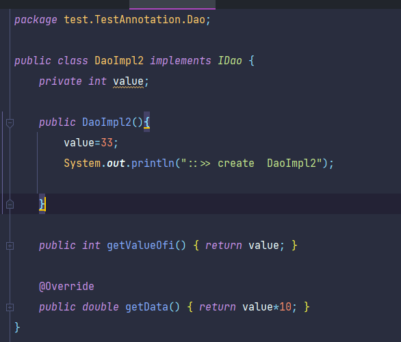

   2. package DaoV2 (`src/test/TestAnnotation/DaoV2`) : contient l'interface IDaoV2 et l'implimentations
      - DaoV2Impl:
        
        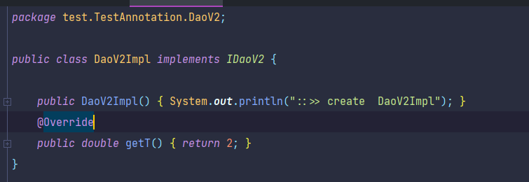

   3. package Metier (`src/test/TestAnnotation/Metier`): contient l'interface IMetier et trois implimentations
      - MetierImplConstructor : pour tester l'injection par constructeur
        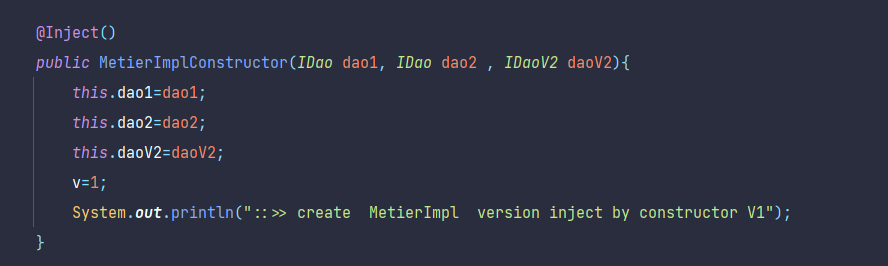
      
      - MetierImplField : pour tester l'injection par les attributs
        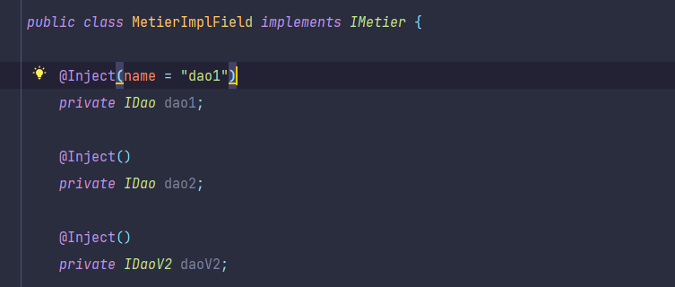
      
      - MetierImplSetter : pour test l'injection par setter et l'utilisation de InjectType.SINGLE_ONE
        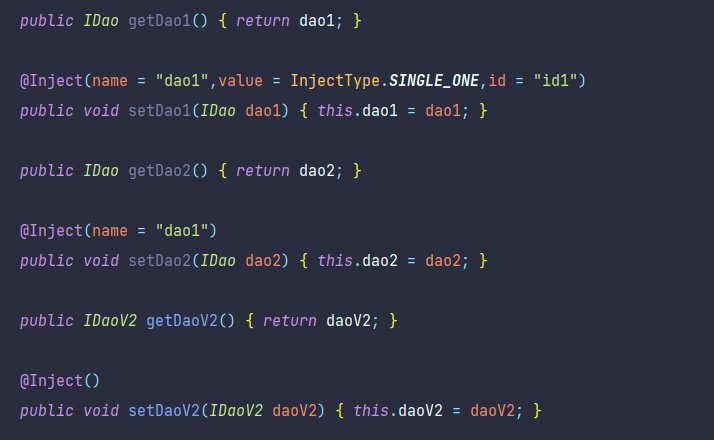

   4. mainTest :
      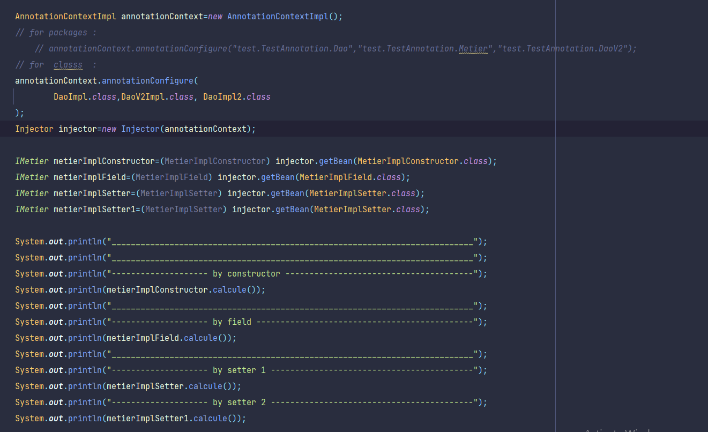

2. resultat de test :

```
::>> create  DaoImpl2
::>> create  DaoImpl2
::>> create  DaoV2Impl
::>> create  MetierImpl  version inject by constructor V1
::>> create MetierImpl  version inject by Field
::>> create  DaoImpl 1
::>> create  DaoImpl2
::>> create  DaoV2Impl
::>> create MetierImpl  version inject by Setter
::>> create  DaoImpl 2
::>> create  DaoV2Impl
::>> create  DaoImpl 3
::>> create MetierImpl  version inject by Setter
::>> create  DaoV2Impl
::>> create  DaoImpl 4
___________________________________________________________________________
___________________________________________________________________________
-------------------- by constructor ---------------------------------------
::>> MetierImpl  version inject by constructor V1
dao instance 33 = 330.0
dao instance 33 = 330.0
daoV2 instance  = 2.0
1.0
___________________________________________________________________________
-------------------- by field ---------------------------------------------
::>> MetierImpl  version inject by Field
dao instance 1 = 10.0
dao instance 33 = 330.0
daoV2 instance  = 2.0
2.0
___________________________________________________________________________
-------------------- by setter 1 ------------------------------------------
::>> MetierImpl  version inject by Setter
dao instance 2 = 20.0
dao instance 3 = 30.0
daoV2 instance  = 2.0
3.0
-------------------- by setter 2 ------------------------------------------
::>> MetierImpl  version inject by Setter
dao instance 2 = 20.0
dao instance 4 = 40.0
daoV2 instance  = 2.0
3.0


```
            
        


