#Application hôpital

## les entités :
Package :(`src/main/java/com/example/app/entities`)

    - Class Patient:
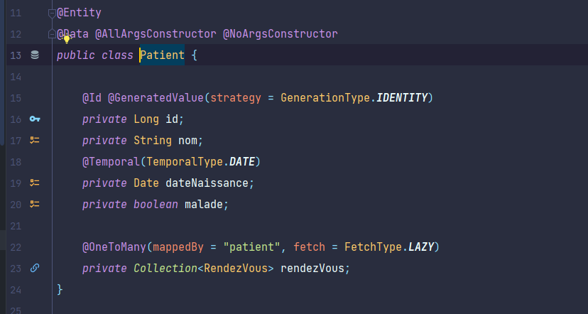

    - Class Medecin:
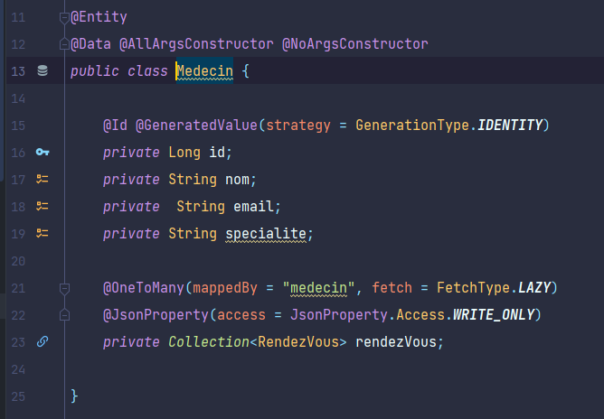

    - Class Consultation:
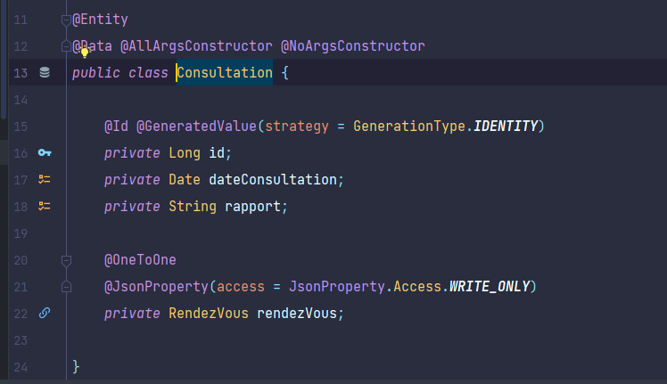

    - Class RendezVous:
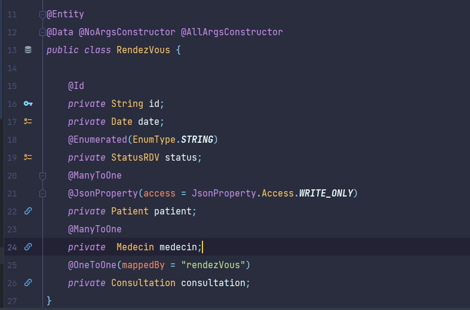

    - Class StatusRDV:
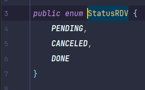

## les repositories :
Package :(`src/main/java/com/example/app/repositories`)

    - ConsultationRepository :

    - MedecinRepository :
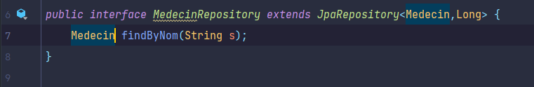

    - PatientRepository :
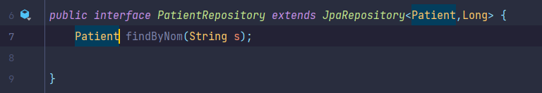

    - RendezVousRepository :
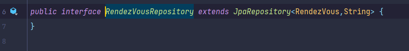

## les Services :
Package :(`src/main/java/com/example/app/service`)

    - Interface IHospitalService
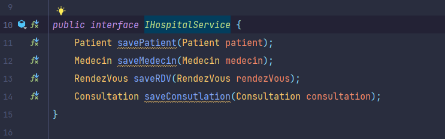

    - L'implimentation :(HospitalServiceImpl)
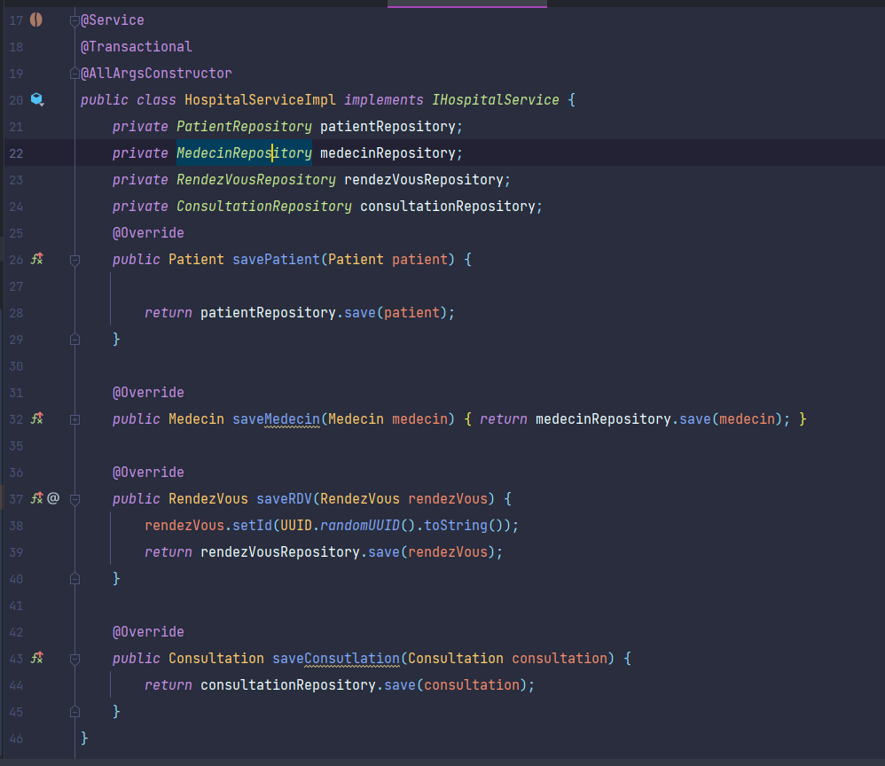

## les Controlleurs :
Package :(`src/main/java/com/example/app/web`)

    -PatientController
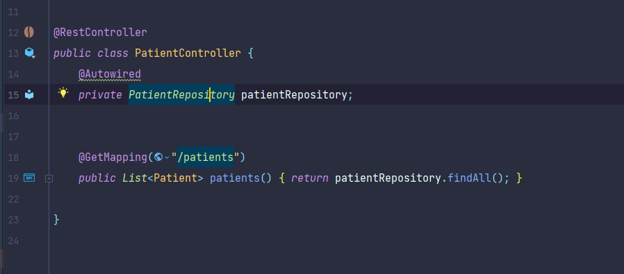

## Applications.properties :
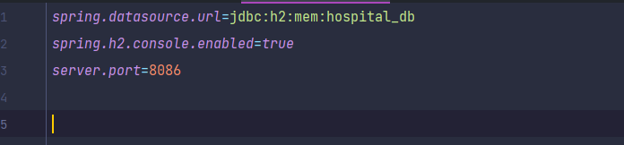

