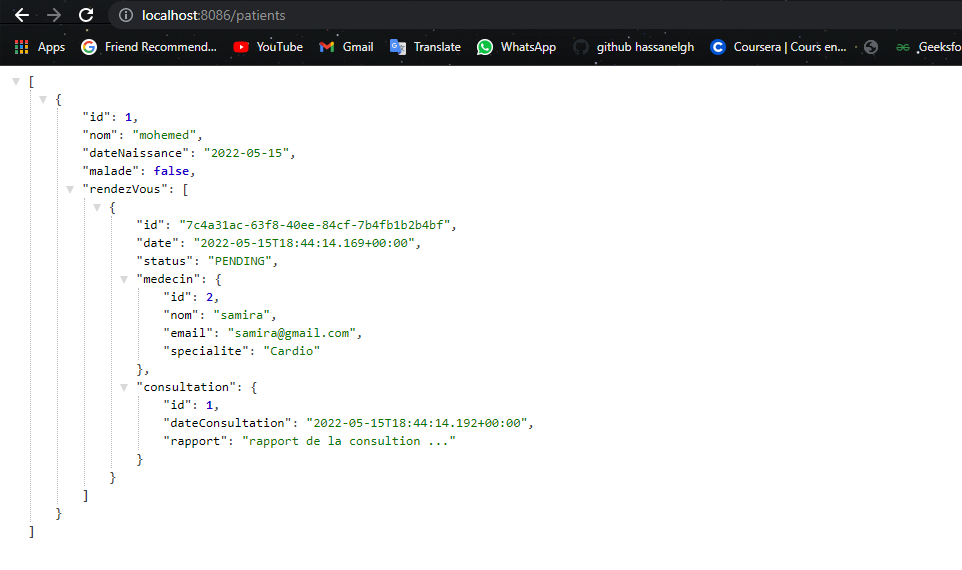

#Application hôpital

## les entités :
Package :(`src/main/java/com/example/app/entities`)

    - Class Patient:

    - Class Medecin:

    - Class Consultation:

    - Class RendezVous:

    - Class StatusRDV:

## les repositories :
Package :(`src/main/java/com/example/app/repositories`)

    - ConsultationRepository :

    - MedecinRepository :

    - PatientRepository :

    - RendezVousRepository :

## les Services :
Package :(`src/main/java/com/example/app/service`)

    - Interface IHospitalService

    - L'implimentation :(HospitalServiceImpl)

## les Controlleurs :
Package :(`src/main/java/com/example/app/web`)

    -PatientController

## Applications.properties :

