# Users et Roles

### Les entities :

    - Role :
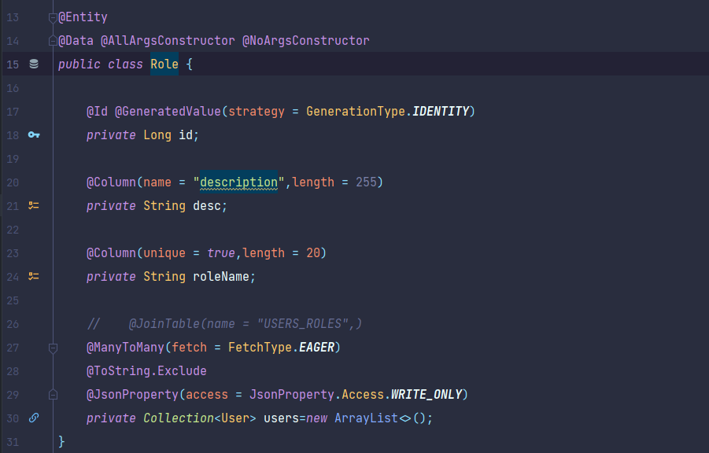

    - User :
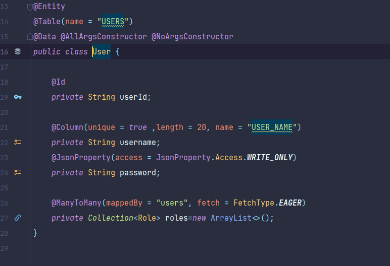

### Repositories :

    - RoleRepository
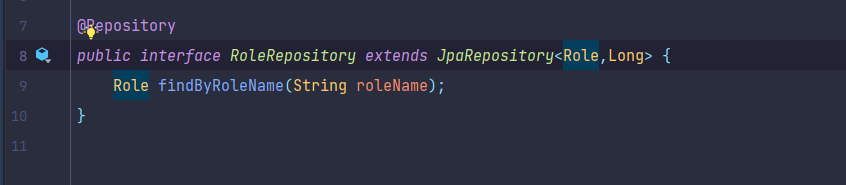

    - UserRepository
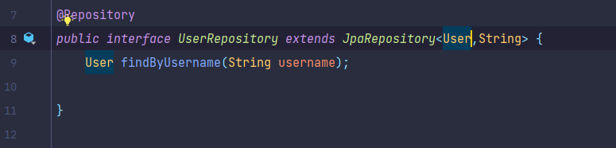

### Service :

    - Interface UserService :
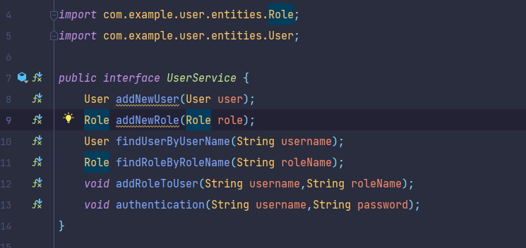

    - Implimentaion :
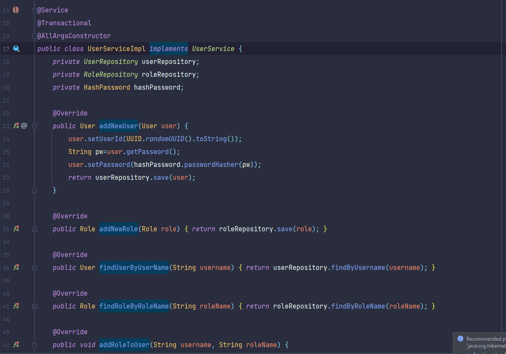
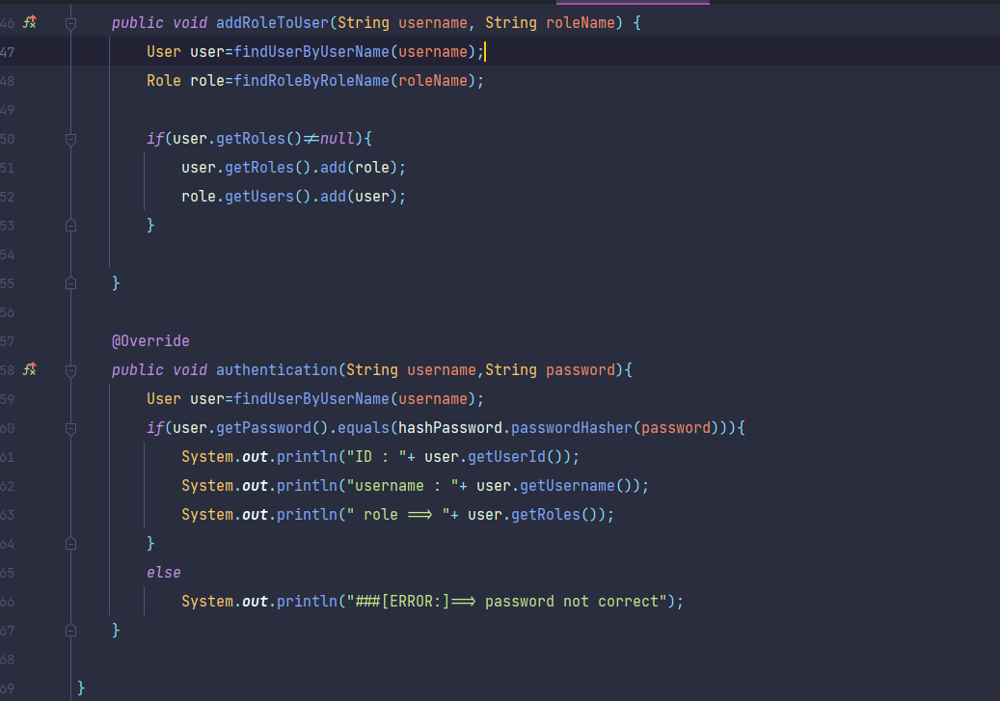

### Controllers :

    - UserController :
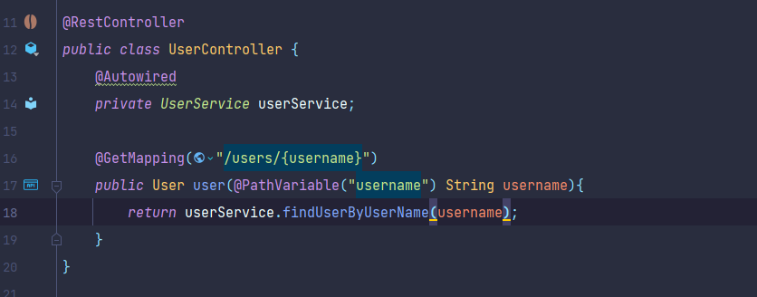

### UserApplication:
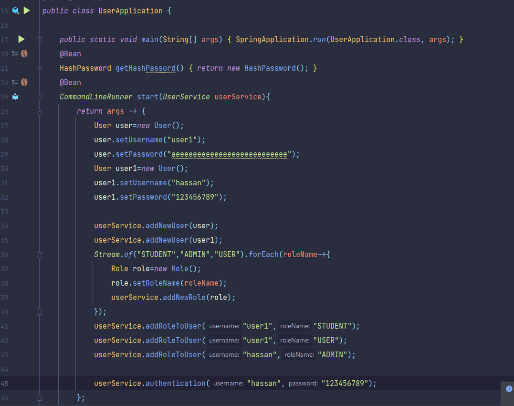

### application.properties :
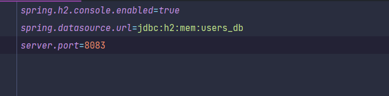

### resultat:
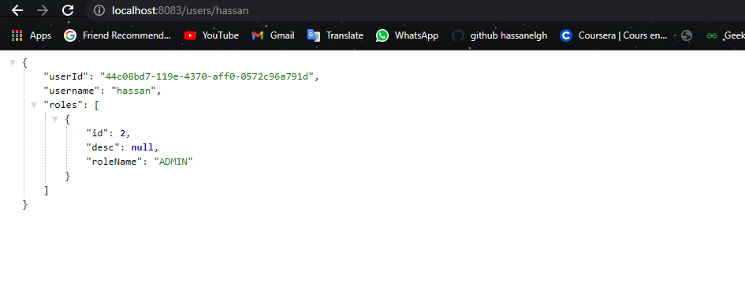

