# Activité Pratique Spring MVC Thymeleaf

Voir la vidéo :Créer une application Web JEE basée sur Spring MVC, Thylemeaf et Spring Data JPA qui permet de gérer les patients. L'application doit permettre les fonctionnalités suivantes :
- Afficher les patients
- Faire la pagination
- Chercher les patients
- Supprimer un patient

### Entities:
package : (`src/main/java/com/example/apppatient/entities`)

    -   Patient:
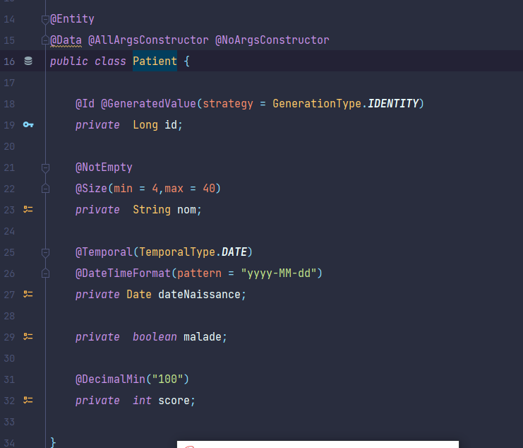

### Repositories:
package : (`src/main/java/com/example/apppatient/repositories`)

    - PatientRepository :
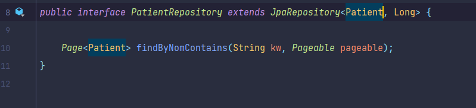

### Security :
package : (`src/main/java/com/example/apppatient/security`)

    - SecurityConfig :
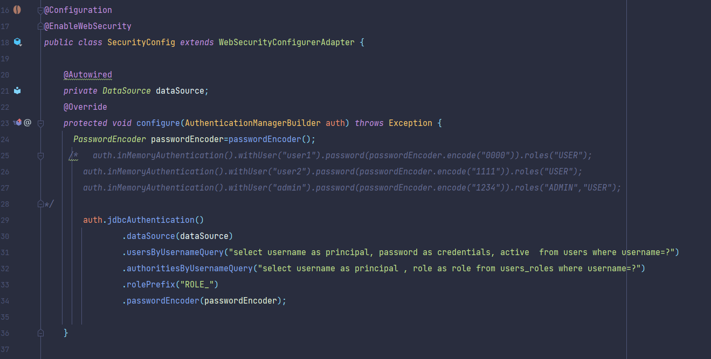
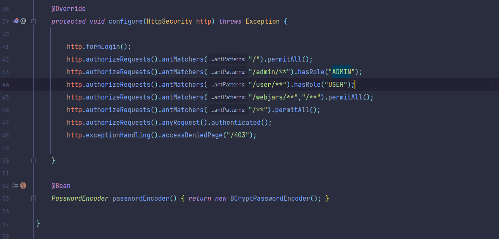

### Templates :
package : (`src/main/resources/templates`)

    - mainTemplate.html :
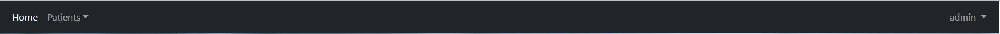

    - home.html :

    - patients.html :
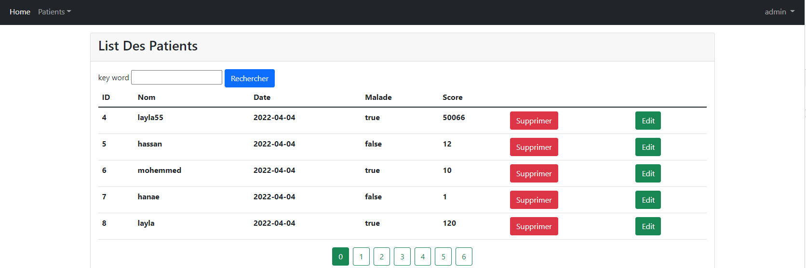

    - formPatients.html :
    - editPatient.html :
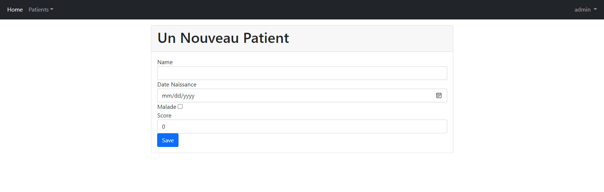

### Web :
package : (`src/main/java/com/example/apppatient/web`)

    - PatientController :
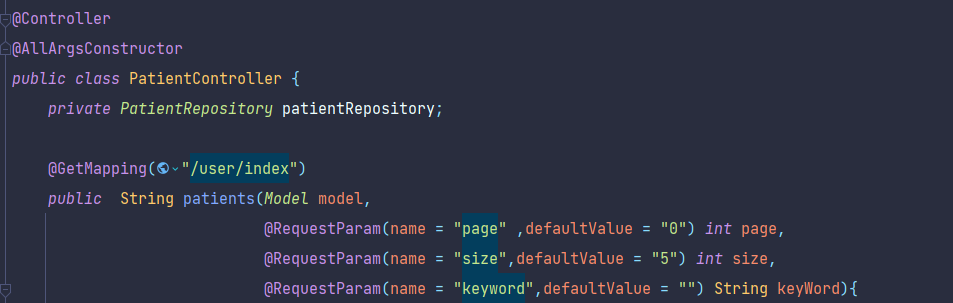
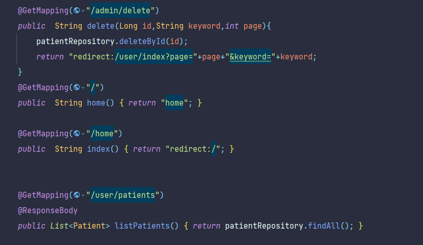
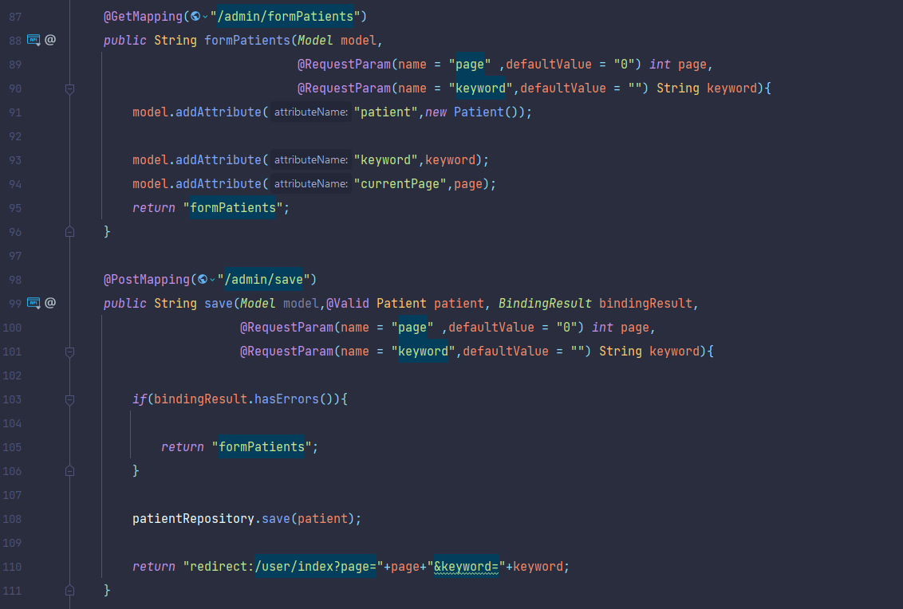

    - SecurityController :
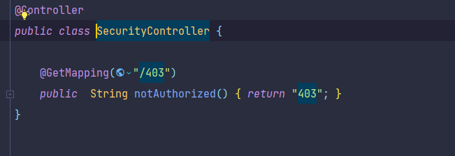

### application.properties :

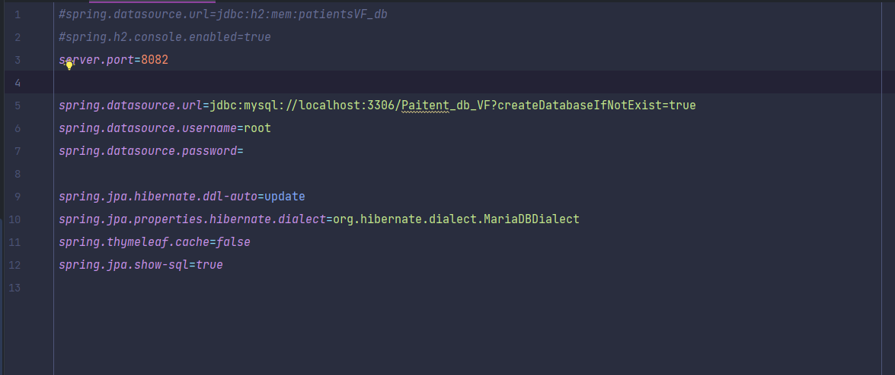

### AppPatientApplication :

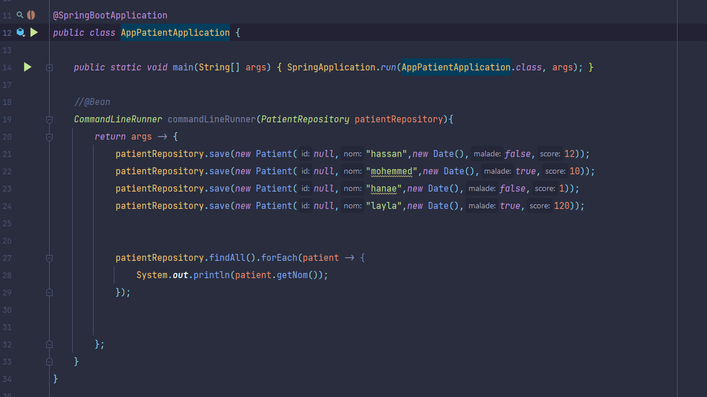

